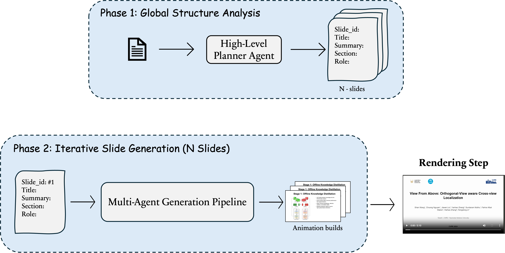
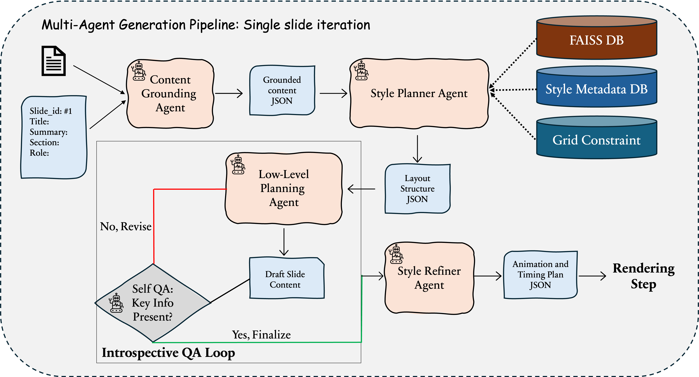

# PIVOT: Planning Intelligent Visual Orchestrations for Translating Papers to Video

## Architecture

### Overview



### Generation Pipeline



## Sample output

Sample outputs can be viewed from this folder:
[sample_outputs/<paper_name>/logs/final_video.mp4](sample_outputs)

- [Attention](sample_outputs/attention/logs/final_video.mp4)
- [Ego3D](sample_outputs/ego3d/logs/final_video.mp4)
- [federated](sample_outputs/federated/logs/final_video.mp4)

## Quick Start

### Installation

```bash
conda create -n ref-agent python=3.10
conda activate ref-agent
pip install -r requirements.txt
```

### Setup

#### Reference Database setup

- It is already created and the files are available in [data_reference/](data_reference)
  - Papers used for reference data generation is available in [data_reference/final](data_reference/final)
  - Section wise faiss index available in [data_reference/faiss](data_reference/faiss)
  - [data_reference/faiss/global](data_reference/faiss/global) is used for retrieving top-k paper for high level planning
  - [data_reference/faiss/introduction](data_reference/faiss/introduction) is used for retrieving top-k paper for introduction
  - [data_reference/faiss/method](data_reference/faiss/method) is used for retrieving top-k paper for method
  - [data_reference/faiss/result](data_reference/faiss/result) is used for retrieving top-k paper for result
  - [data_reference/faiss/conclusion](data_reference/faiss/conclusion) is used for retrieving top-k paper for conclusion

- If you want to create for a new repository of research papers you can execute the following commands. Its a one-time time consuming process. We recommend you to use the existing files in [data_reference/final](data_reference/final)

```bash
# Generate per-paper section summaries from PDFs.
python tools/extract_section_summaries_gemini.py

# Normalize those summaries into standard section buckets.
python tools/normalize_section_summaries.py

# Build section-specific FAISS indices (introduction/method/experiments/results) from categorized outputs.
python tools/build_section_wise_indices.py

# Build the global retrieval FAISS index for whole-paper similarity (data_reference/faiss/global).
python tools/rebuild_global_index.py
```

#### Presentation Generation

```bash
python run.py "dataset/attention.pdf" --output_dir "output/"
```

### Execution Flow (`run.py`)

#### 0. Offline Knowledge Prep (usually done before `run.py`)

These populate the databases used by retrieval/style planning:

1. `tools/extract_section_summaries_gemini.py`  
   PDFs -> section-wise summary JSONs.

2. `tools/categorize_sections_gemini.py`  
   Raw section summaries -> normalized categories (`abstract/introduction/method/experiments/results/conclusion/supplementary`).

3. `tools/build_section_wise_indices.py`  
   Categorized summaries -> section-wise FAISS indices (`data_reference/faiss/{introduction,method,experiments,results}`).

4. `tools/rebuild_global_index.py`  
   Paper corpus -> global FAISS index (`data_reference/faiss/global`).

---

#### 1. Runtime Entry

python run.py "<input_pdf>" --output_dir "<output_dir>"

- `run.py` validates inputs and instantiates `Agent`.
- `Agent` initializes:
  - LLM planner/evaluator/art agents
  - TTS/image/video tools
  - `SlideRenderer`
  - retriever + style DB handles

---

#### 2. Retrieval Source Selection

At init, retriever chooses index in priority order:

- `data_reference/faiss/global` (preferred)

This is the FAISS DB side in the Generation pipeline diagram.

---

#### 3. High-Level Planning (Document -> Scene List)

- Input PDF is analyzed into a high-level sequence of scenes.
- Similar-paper retrieval provides global context (titles/examples).
- Title scene metadata is extracted and prepended as scene 0.

Output: ordered scene plans (`slide_id`, title, summary, section/role-like metadata). Eg: [sample](sample_outputs/attention/logs/highplan.txt)

---

#### 4. Per-Scene Iteration (matches your “single slide iteration”)

For each scene/slide:

1. **Content Grounder Agent**  
   Produces grounded content JSON from scene intent + source paper context. Eg: [sample json for one slide](sample_outputs/attention/logs/content_2.json)

2. **Style Planner Agent**  
   Uses:
   - FAISS retrieval (global + section-wise where relevant)
   - style metadata DB (`style_db_refined_final`)
   - layout constraints  
     Produces layout structure JSON (`LayoutSpec` style structure). Eg: [sample json for one slide](sample_outputs/attention/logs/style_2.json)

3. **Low-Level Planning Agent**  
   Builds draft slide payload (text blocks, figure slots, audio content, timings, prompts). Eg: [sample json for one slide](sample_outputs/attention/logs/low_2.json)

4. **Introspective QA Loop**  
   Self-check: “key info present?”
   - **No** -> revise low-level plan and re-check
   - **Yes** -> finalize scene plan

5. **Style Refiner Agent**  
   Final polish of layout/animation/timing decisions. Eg: [sample json for one slide](sample_outputs/attention/logs/refine_2.json)

Output: final animation + timing plan JSON for that scene.

---

#### 5. Rendering Step

- Scene plan is rendered to assets/video (`scene_i/scene{i}.mp4`) via `SlideRenderer` and tool wrappers.
- Audio is generated and merged as needed. Eg: [sample video for one slide](sample_outputs/attention/scene_2)

---

#### 6. Final Assembly

- All scene videos are concatenated in order.
- Final output video is written to the run output directory.
- Rendered videos can be viewed from the output folder as follows:
  [<output_folder>/<paper_name>/logs/final_video.mp4](sample_outputs)

---

### Important

You should be having Gemini key and free alibaba key to run the script. If you are based in china you the china server, or else stick with Singapore server for international version.

## Acknowledgement

This work is a follow-up to Preacher (ICCV 2025). The codebase builds on Preacher’s original framework, which incorporates both high-level and low-level planning.

We extend this setup by introducing style planning using a reference database, style refinement mechanisms, and an introspective QA loop to improve content grounding.
